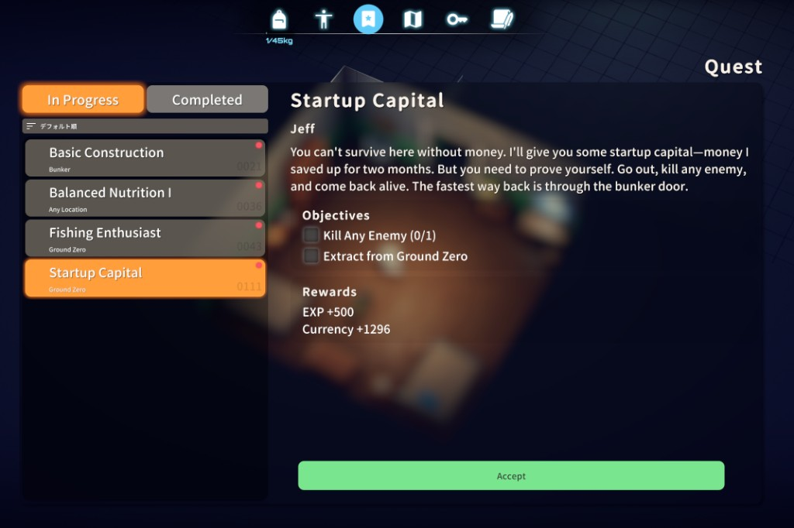

# Duckov_QuestsAnywhere

『Escape from Duckov』のmodです。

NPCに話しかけなくても、既存のクエスト一覧から受注と報告ができます。

出撃中は報告できません。受注は出撃中も可能です。



## 機能

- クエストメニューから直接受注できます
- クエストメニューから完了済みクエストを報告できます
- ボタンの見た目と文言はゲーム本体のNPC画面に寄せています
- 出撃中は報告を無効化し、受注は可能なままにしています
- 対応言語は日本語、英語、簡体字中国語、韓国語です

## 説明

- `進行中` タブに受注可能クエストも表示されます
- クエストを選ぶと、下部のボタンから受注または報告ができます
- ボタンの文言と色は、NPC画面の挙動に合わせています

## English

This is a mod for **Escape from Duckov**.

Accept and turn in quests from the existing quest list without talking to NPCs.
Turn-in is disabled during raids, while accepting quests still works.

### Features

- Accept quests directly from the quest menu
- Turn in finished quests directly from the quest menu
- Reuse the game's own button look and text style
- Keep turn-in disabled during raids while still allowing acceptance
- Support Japanese, English, Simplified Chinese, and Korean

## Build

Set `DuckovPath` in `QuestBoard.csproj` to your game install, then:

```
dotnet build
```
